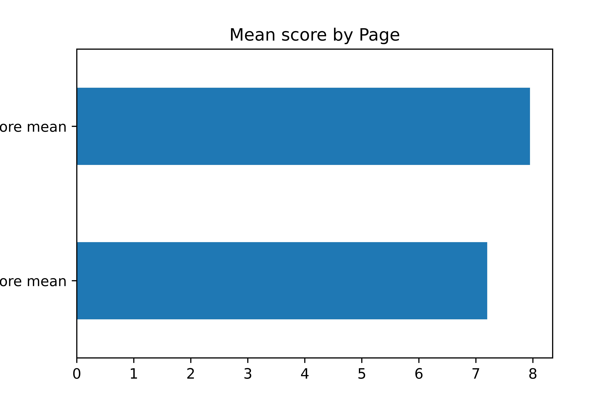
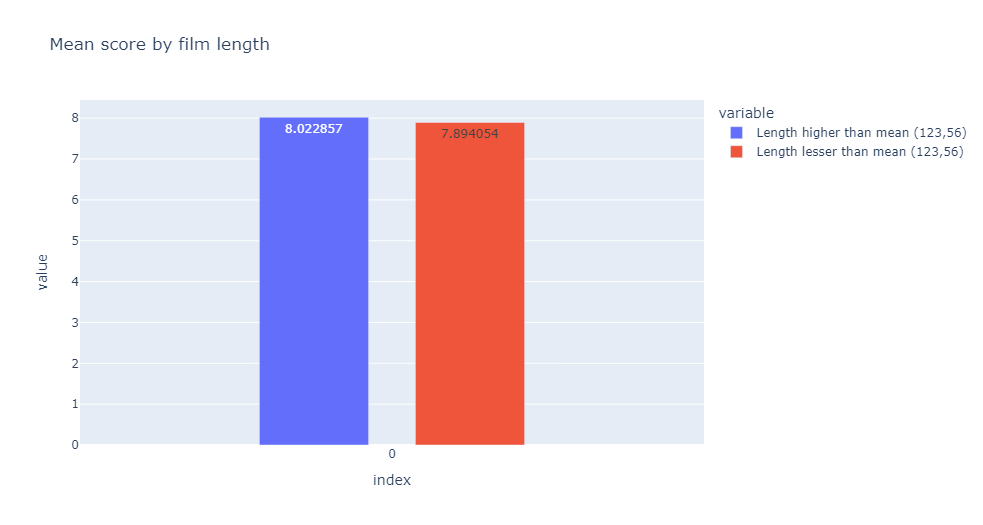

## Web Scrapping of Filmaffinity Database:
### By: Gaspar Masdeu
### Date: July 25th 2022

## Welcome to my second project.

#### During this project I will use an imdb database already created to scrap the filmaffinity website in order to compare how users rate, review or comment the movies on two different websites.

#### Filmaffinity is the largest movie review website in Spain. It is the Spanish IMDB. That's why I thought it was interesting to compare it with IMDB.

#
## Hypothesis:
#

1. Filmaffinity users gives lower scores overall.
2. IMDB users likes shorter movies.
#

## ORGANIZATION:

The first step is to download the database of the top 1000 movies, available on the Kaggle website:

     https://www.kaggle.com/datasets/harshitshankhdhar/imdb-dataset-of-top-1000-movies-and-tv-shows
     
This database gives us the name of the movie (in English), the id of the movie (which we will use to get the link to the movie on imdb), and other data that will not be useful for web scraping.

### Scraping

The scrapping part is the hard part of this project. In the FUNCTIONS.py files you have the functions that i used to iterate the database and find the results i wanted. For scrapping i used BeautifulSoup and for managing the data i used Pandas Dataframe.

The first problem i found was that i needed the name of the movie in SPANISH, so i can search it in the filmaffinity page. To find it, i just get the link of the imdb page (which is in the database from kaggle), and since im in Spain, it will redirect me to the spanish imdb page. From there, i find the spanish name. I used the next function:

    def get_spanish_name(titled):

I used the information of the database to get the rating, the number of voters and other info that i have to use to prove my hipotesis. 

Once i got the name, we can search it and scrap the filmaffinity webpage:
       
    def search_filmaffinity_movie_href(title):
  
The argument of this function is a string, which will be ideally the name of a movie in spanish. For example, "Origen".
This function returns the link to the filmaffinity page of the movie we want. In this case:

    https://www.filmaffinity.com/es/film971380.html

But why do we need it?

Now that we got the link, we can scrap the webgape and gather all the information of the main filmaffinity page of the film, like the rating, the number of voters, etc... The function only returned us 4 errors out of 350 calls. Once that i have all the information that i need, i just need to merge it together in one big dataframe to clean it

### Cleanup:
#

The functions are done so that they return me clean data. I only cleaned by changing some formats of the original dataset, and i also dropped the Nan value.

### Analysis:
#

# 1. Filmaffinity gives overall lower scores than IMDB.

Filmaffinity mean < IMDB mean.

Lets plot the Filmaffinity Mean and the IMDB mean to represent visually our hypotesis:

#### The first one is the IMDB mean.

#### The second one is the Filmaffinity mean.

### Conclusion:
#

In conclusion, since IMDB has a higher average than filmaffinity, we can affirm that filmaffinity gives worse marks than IMDB.

# 2. Imdb users like shorter movies more than longer movies

Lets plot the IMDB mean based on the length of the movies to represent visually if they like longer movies or shorter movies:

## Conclusion
# 

#### IMDB users likes longer movies more than shorter movies, based on the top 300 movies of all time.
#

#### Thanks for reading!
